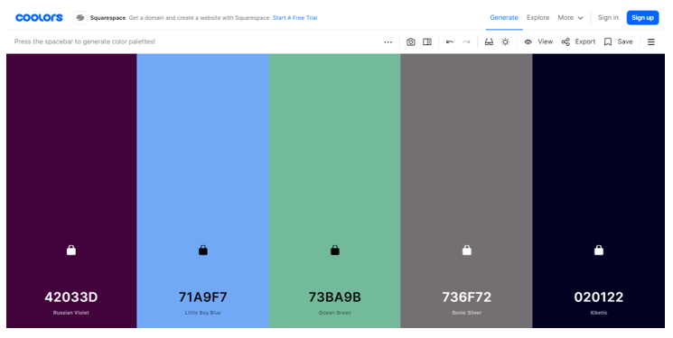
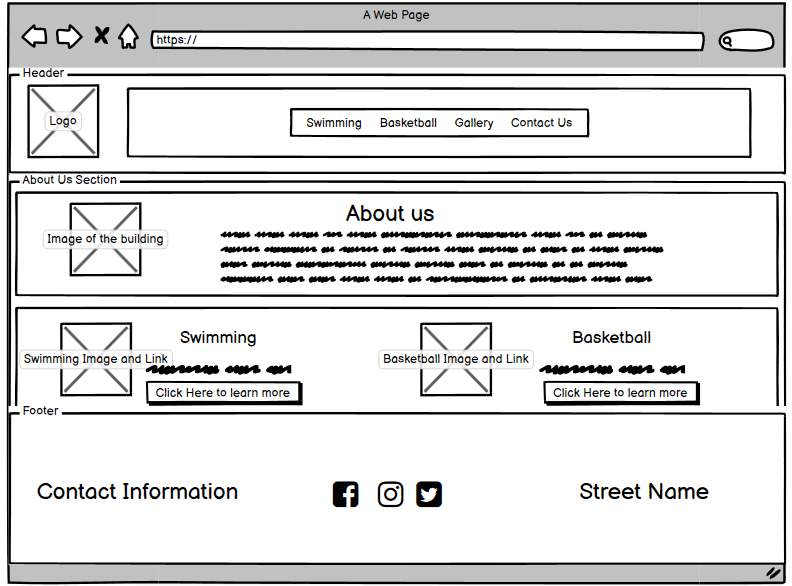
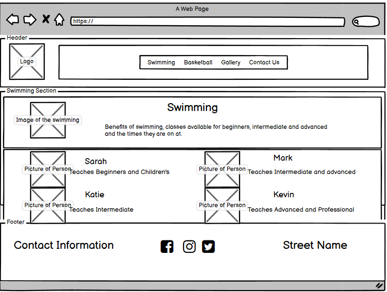
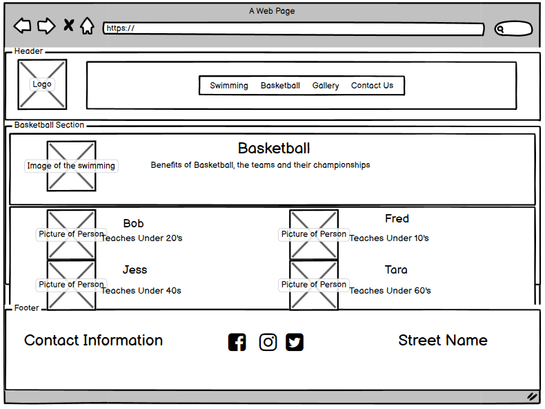
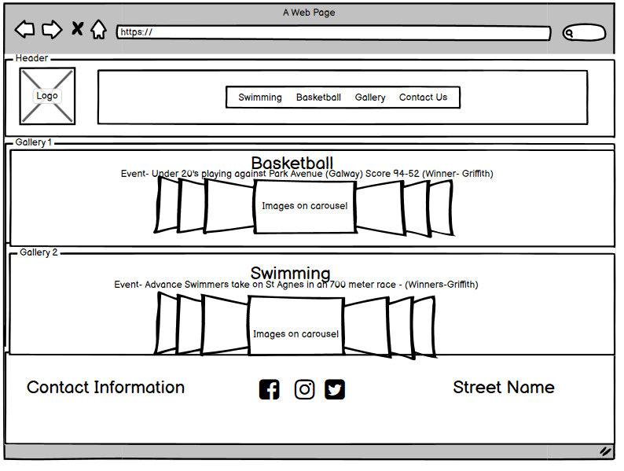
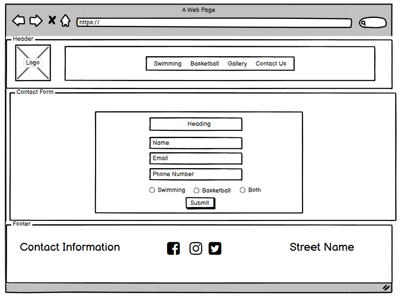
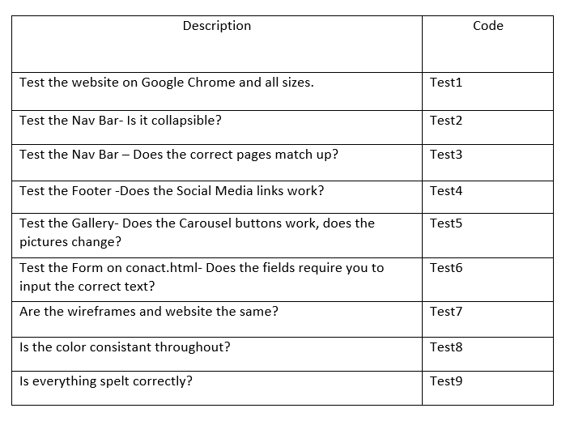

# Milestone Project 1
- - - - - - - - - - - - - - - - - - - - - - - - - - - - - - - - - - - - 
## Table of Contents
* [Purpose](#Purpose)
* [User Experience Design (UX)](#User-Experience-Design)
  * [User stories](#User-Stories)
    * [First Time Visitor Goals](#First-Time-Visitor-Goals)
    * [Returning Visitor Goals](#Returning-Visitor-Goals)
    * [Frequent User Goals](#Frequent-User-Goals)
  * [Structure](#Structure)
  * [Design](#Design)
    * [Colour Scheme](#Colour-Scheme)
    * [Typography](#Typography)
    * [Imagery](#Imagery)
    * [Wireframes](#Wireframes)
* [Limitations](#Limitations)
- [Features](#Features)
    * [Existing Features](#Existing-Features)
    * [Future Features](#Features-Left-to-Implement)
* [Technologies](#Technologies)
* [Testing](#Testing)
    * [Test Strategy](#Test-Strategy)
      * [Summary](#Summary)
      * [High Level Test Cases](#High-Level-Test-Cases)
      * [Out of Scope](#Out-of-Scope)
    * [Test Results](#Test-Results)
    * [Testing Issues](#Issues-and-Resolutions-to-issues-found-during-testing)
* [Deployment](#Deployment)
    * [Project Creation](#Project-Creation)
    * [GitHub Pages](#Using-Github-Pages)
    * [Locally](Run-Locally)
* [Credits](#Credits)
  * [Content](#Content)
  * [Media](#Media)
  * [Acknowledgements](#Acknowledgements)
  * [Comments](#Comments)

## Purpose
This website was created for Milestone Project 1 in the Software Developement Course in Code Insitute.
The languages used in this project are languages that I've learned so far in the course, HTML, CSS and User Centric Design.

The live website can be found [here](https://ailisc97.github.io/Milestone_Project_1/)

## Griffith Park Leisure Centre Responsive Website

![Website Mock Up] (assets/images/readme-images/screens.PNG)

The Giffith Park Leisure Centre is based on an imaginary sport centre based in Dublin 4. The benefit to this website is that people can check out the two main sports (swimming and basketball) that are in this sport centre.
The client requested to show the muliple different classes in the facility. The client requested to show off the Coaches in the sports centre and to give a little bit of information about the different coaches.
Having the Gallery was a great way to show off the most recent championships with the different teams. The Contact page was a necessity for the website and it was essential for the users who had different questions about the multiple different classes avilable.

- - - - - - - - - - - - - - - - - - - - - - - - - - - - - - - - - - - - 
## User Experience Design

### User stories
#### First Time Visitor Goals
* As a First Time user, I want to easily and quickly navigate the website to learn more about the Leisure Centre.
* As a First Time user, I want to easily and quickly navigate the website to check what sports are played in this Sport Centre.
* As a First Time user, I want to view the website and content clearly on my mobile device.
* As a First Time user, I want to find ways to follow the Leisure Centre on different social media platforms.
* As a First Time user, I want to know the loaction and opening hours of the Centre.
#### Returning Visitor Goals
* As a Returning user, I want to check the times for any of the swimming or basketball classes.
* As a Returning user, I want to contact the centre for any questions I have.
* As a Returning user, I want to know which coach teaches what class.
#### Frequent Visitor Goals
* As a Frequent user, I want to check to see the results and pictures of the new competitions.
* As a Frequent user, I want to check to see when the next swimming races are on.
* As a Frequent user, I want to sign up to the Newsletter so I can always be in the loop.

### Structure
All Pages will have a Navigation bar (using Bootstrap) at the top of the Webpage that allows the User to easily navigate between the different pages of the site.
The Navigation bar is collapsable into a hamburger menu on a Mobile device, this will help maximise the space.
The purpose of this is to fulfill user story:
> As a First Time user, I want to view the website and content clearly on my mobile device.

Bootstrap will be used to make the Website responsive by the use of media queries and/or the Boostrap Grid system.

All pages will be responsive to multiple different devices, Phone, Tablets and Desktop. Using Bootstrap and media max and min widths will help with the font not being too big/small,
or the photos being too big/small.
The purpose of this is to fulfill user story:
> As a First Time user, I want to view the website and content clearly on my mobile device.

The Home Page will contain an about us, which talks about the orgins of the club.
The purpose of this is to fulfill user story:
> As a First Time user, I want to easily and quickly navigate the website to learn more about the Leisure Centre.

Under the about us on the Home Page there will be a small discription of the sports that are played in this club.
The purpose of this is to fulfill user story:
> As a First Time user, I want to easily and quickly navigate the website to check what sports are played in this Sport Centre.

All pages will contain a Footer Element with Opening Hours, Contact Information, Location and Responsive Social Media Icons. The icons used will be
from font-awesome. Once clicked they will take the user to the desired Social Media platform. 
The aim of the Footer elements are to fulfill user stories:
> As a First Time user, I want to find ways to follow the Leisure Centre on different social media platforms.. 
> As a First Time user, I want to know the loaction and opening hours of the Centre.

The Swimming Page will contain information about the multiple different classes and the the times they are on at. Below this the User can see the Coaches and read about their bio and learn about what class they teach.
The purpose of this is to fulfull user stories:
> As a First Time user, I want to easily and quickly navigate the website to check what sports are played in this Sport Centre.
> As a Returning user, I want to check the times for any of the swimming or basketball classes.
> As a Returning user, I want to know which coach teaches what class.
> As a Frequent user, I want to check to see when the next swimming races are on.

The Basketball Page will contain information about the multiple different classes and the the times they are on at. Below this the User can see the Coaches and read about their bio and learn about what class they teach.
The purpose of this is to fulfull user stories:
> As a First Time user, I want to easily and quickly navigate the website to check what sports are played in this Sport Centre. 
> As a Returning user, I want to check the times for any of the swimming or basketball classes. 
> As a Returning user, I want to know which coach teaches what class.

The Gallery Page will contain 3 to 4 photos of the previous events, the scores and winners of the competitions and events will be listed below the photos. 
Bootstrap will be used for a carousel of the images. 
The purpose of this is to fulfull user stories:
> As a Frequent user, I want to check to see the results and pictures of the new competitions.

The Contact Page will contain a form that can be used to contact the Club through the website. This will also contain a check 
box that will allow the user to sign up for the Clubs newsletter in order to keep up to date with the club. There will also be a text box for the user to input their questions directly into.
The purpose of this Page is to fulfill user stories:
> As a Returning user, I want to contact the centre for any questions I have. 
> As a Frequent user, I want to sign up to the Newsletter so I can always be in the loop.

### Design
#### Colour Scheme

The main colour used is Ocean Green (#73BA9B). This is used as the background color.
The secondary colours are Russian Violet (#42033D) as an accent colour. Xiketic (#020122) the colour of the words. A shade of dark grey (#343A40) on the Navigation Bar.
I choose these colours from a website called Coolors. The website helped choose the colours that would go together so I had a great palette to work from.

####  Typography
The font on the website is **Roboto**. This font was off Google Fonts. The font colours for the headings and paragraphs are Xiketic (#020122). The font colour in the Navigation Bar is White (#F8F9FA).
The font colour in the Footer is a mixture of Xiketic (#020122)and the headings are a Russian Violet (#42033D).

#### Imagery
The Home page has three images, the first is an image of the sport centre building at a distance. The second image is the swimming pool. The third image is of the outdoor basketball court.
The Swimming page has an image of a race and under that an image of pool arobics. There is also images of the team members.
The Basketball page has an image of the outdoor basketball court and and image of the childrens team in the indoor basketball court. There is also images of the team members.
The Gallery has two carousels. The first carousel holds images of a swimming competition and the second carousel holds images of the childrens basketball game.

All images were taken off Unsplash.com. Which is a website for stock images. It was important to get stock images as I might not have rights over google images.

#### Wireframes
Home Page-Desktop 
 
Swimming Page-Desktop 
 
Basketball Page-Desktop 
 
Gallery Page-Desktop 
 
Contact Page-Desktop 
 

Home Page-Mobile 
 
Swimming Page-Mobile 
 
Basketball Page-Mobile 
 
Gallery Page-Mobile 
 
Contact Page-Mobile 
 

For full side PDF's of the wireframes, please click the links below
* [Home Page-Desktop Wireframe](assets/wireframes/Home-Desktop.PNG)

* [Swimming Page-Desktop Wireframe](assets/wireframes/Swimming-Desktop.PNG)

* [Basketball Page-Desktop Wireframe](assets/wireframes/Basketball-Desktop.PNG)

* [Gallery Page-Desktop Wireframe](assets/wireframes/Gallery-Desktop.PNG)

* [Contact Page-Desktop Wireframe](assets/wireframes/Conact-Desktop.PNG)

* [Home Page-Mobile Wireframe]()

* [Swimming Page-Mobile Wireframe]()

* [Basketball Page-Mobile Wireframe]()

* [Gallery Page-Mobile Wireframe]()

* [Contact Page-Mobile Wireframe]()

- - - - - - - - - - - - - - - - - - - - - - - - - - - - - - - - - - - - 

### Limitations
Not having JavaScript funcationality in my website, the form on Contact.html wont be saved.

- - - - - - - - - - - - - - - - - - - - - - - - - - - - - - - - - - - - 

## Features
 
### Existing Features
- Contact Form - This can be completed on the contact.html page and used in order to contact the club with any queries users may have.
- Carousel Gallery - There are 2 carousel sliders within the Website. Both of the carousels are on the Gallary page. One to show off the swimming competition and another to show off the childrens basketball match.

### Features Left to Implement
-It would be great for the Users details to be save into the website.
-It would also be nice to have the social media icons linked to an actual page, as this is a fiction based website, this was not possible.
- - - - - - - - - - - - - - - - - - - - - - - - - - - - - - - - - - - - 

## Technologies
  
* HTML
	* This project uses HTML as the main language used for the Website.
* CSS
	* This project uses CSS to style the Website.
* [Bootstrap](https://getbootstrap.com/)
	* The Bootstrap framework is used for Navigation bar, the carousel and the contact us form.
* [Font Awesome](https://fontawesome.com/)
	* Font awesome Icons are used for the Social media links on the footer of every page.
* [Google Fonts](https://fonts.google.com/)
	* Google fonts are used throughout the project to import the *Roboto* font.
* [GitPod](https://www.gitpod.io/)
    *GitPod is used to develop the website and where the code for the website was wrote.
* [GitHub](https://github.com/)
	* GithHub is the site used to store the code for the Website and [Git Pages](https://pages.github.com/) is used for the deployment of the live site.
* [Git](https://git-scm.com/)
	* Git is used as software to commit and push code to the GitHub repository where the source code is stored.
* [Google Chrome Developer Tools](https://developers.google.com/web/tools/chrome-devtools)
	* Google chromes built in developer tools are used to inspect page elements in various different sized. It also helped debug issues and test different CSS styles.
* [Balsamiq Wireframes](https://balsamiq.com/wireframes/)
	* This was used to create desktop and phone wireframes for UX design.
* [Coolors](https://coolors.co/)
    *This was used to create a colour scheme that works well together.
* [Hex to RGB](https://www.rgbtohex.net/hextorgb/)
    *This was used to get the colours from HEX to RGBA. 
* [Unsplash](https://unsplash.com/)
    *This website was used to get the pictures on the website.
* [Techsini](http://techsini.com/multi-mockup/index.php)
    * tecnisih.com Multi Device Website Mockup Generator was used to create the Mock up image in this README

- - - - - - - - - - - - - - - - - - - - - - - - - - - - - - - - - - - - 
## Testing

### Test Strategy 

#### Summary 

Testing is required on Milestone Project 1 Griffith Park Leisure Centre Responsive Website.

As this project is static and contains no back-end functionality, the testing performed will be on the visual effects and layout of the Website. Testing to be done on Google Chrome web browser and all screen sizes.

Elements shouldnt overlap divs. Elements should be on the screen at all sizes. All carousel items should be able to change the pictures automatically, also with the buttons on the side and on the bottom buttons.

In the Navigation bar the links should take the user to the correct html page. The Home page will be redirected to index.html.

On the Contact.html page the form must not be submitted until the required information is inputted into the fields.

Validation of inclusion for all features included in the Structure of the Website / Wireframes must be performed.

The live Project can be found [here](https://ailisc97.github.io/Milestone_Project_1/). 
#### High Level Test Cases 

#### Out of Scope  
* Cant test phone number or email from the contact-us form.
* There is no way to save forms.

### Test Results
Testing results can be found [here](assets/images/readme_images/Testing-detail.xlsx) 
This results are a .xlsx file and will need excel to open.  
All Pages were run through the [W3C HTML Validator](https://validator.w3.org/), there was no errors. 
CSS Stylesheet was run through the [W3C CSS Validator](https://jigsaw.w3.org/css-validator/#validate_by_uri),there was no errors. 

* As a First Time user, I want to easily and quickly navigate the website to learn more about the Leisure Centre.-Testing was completed.- Testing was done to see how easy it is to navigate the website.
* As a First Time user, I want to easily and quickly navigate the website to check what sports are played in this Sport Centre. -Testing was done to see how easy it is to see what sports are played in this club.
* As a First Time user, I want to view the website and content clearly on my mobile device. -Testing was done to see if it was compatable on all mobile devices.
* As a First Time user, I want to find ways to follow the Leisure Centre on different social media platforms. -Testing was done to see if it was easy to get the social media platforms up.
* As a First Time user, I want to know the loaction and opening hours of the Centre. - Testing was done to see how easy it was to see the location and opening hours.

* As a Returning user, I want to check the times for any of the swimming or basketball classes. -Testing was done to see what times are the swimming and basketball classes on at. 
* As a Returning user, I want to contact the centre for any questions I have. -Testing was done to see if questions could be sent to the leisure centre.
* As a Returning user, I want to know which coach teaches what class. -Testing was done to see if it was easy to see what coach tought which class.

* As a Frequent user, I want to check to see the results and pictures of the new competitions. - Testing was done to see if the carousels showed hte pictures of the new competitions.
* As a Frequent user, I want to check to see when the next swimming races are on. -Testing was done to see when the next swimming race is on.
* As a Frequent user, I want to sign up to the Newsletter so I can always be in the loop. -Testing was done to see if you could sign up to a newslettter.

### Issues and Resolutions to issues found during testing
* Griffith Park Leisure was changed to Girffith Leisure, as on Moto4 the nav bar moved over too much.
* On images.html the second carousel had to be slightly edited as the buttons of the second carousel was controlling the first carousel, so the buttons were deleted.
- - - - - - - - - - - - - - - - - - - - - - - - - - - - - - - - - - - - 
## Deployment

### Project Creation
I created a repository in Github and called it Milestone_Project_1, I selected to add a README into the project. When I went into the repository, I clicked the GitPod button on the top right and that opened GitPod for me. I used Git to add, commit and push all my saved work from GitPod.

*git add . -This would add all the work from the different pages to the GitHub.
*git add index.html -Would only save the work from Index.html
*git pull - This would pull the GitHub version of my project.
*git commit -m "MESSAGE" - This would commit the added work from git add . and leave a message beside it.
*git push- This pushed the added work to GitHub
*python3 -m http.server - This opened the website on the right hand side of the page.

### Using Github Pages
1. On the GitHub [Repository:](https://github.com/ailisc97/Milestone_Project_1)
1. Click the 'Settings' Tab on the right hand side.
1. Click on options.
1. Scroll Down to the Git Hub Pages Heading.
1. Select 'main' as the source.
1. Click the Save button.
1. Click on the link to go to the deployed page

### Run Locally
1. On the GitHub [Repository:](https://github.com/ailisc97/Milestone_Project_1)
1. Click on the download code button, you will get options to clone the GitHub Repository or Download the Zip file.
1. If you downloaded the zip file open the file using one of your IDE application.
1. Or if you choice to clone the GitHub Repository, then open up a terminal and get to a directory of your choice then type in "git clone" followed by the GitHub Repository URL.
1. The clone will be created on your loacal machine. 

- - - - - - - - - - - - - - - - - - - - - - - - - - - - - - - - - - - - 
## Credits

### Code
Code for the Navigation bar, carousel and the contact us form. was taken from [Bootstrap](https://getbootstrap.com/).
### Content
Content was created by Ailis Curran, based on a fictional Leisure Centre.
### Media
All images were taken from [Unsplash](https://unsplash.com/). Which are all stock images.
### Acknowledgements
I would like to thank my mentor Spencer Barriball for all his help throughout the project.  
###Comments
README.md insperation was taken from Daisy Mc Girr. It gave me a template to complete my README, all README content is my own.